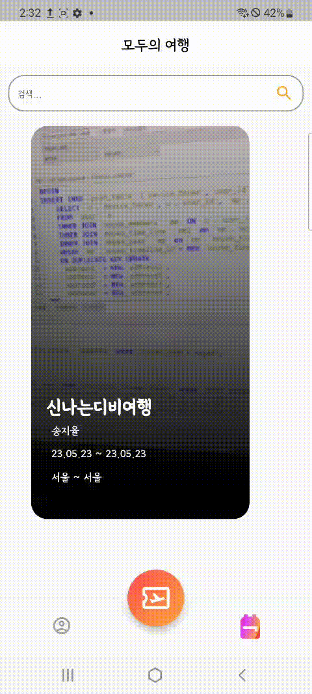
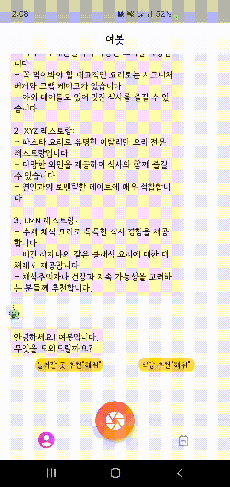
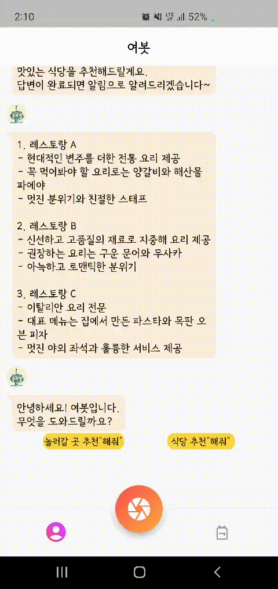
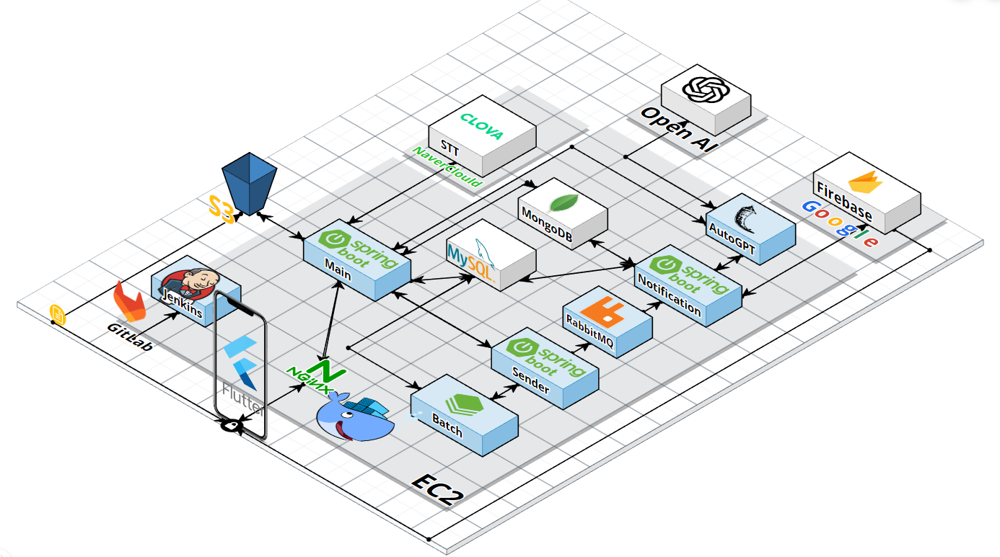
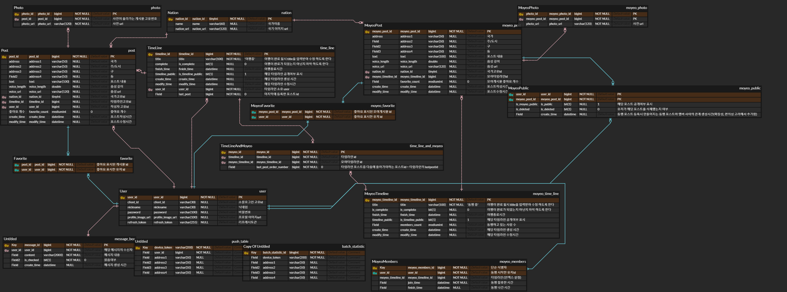

# 🧳Mo-Yeo 모여🤝

---

---

## ✈프로젝트 진행 기간✈

### Project Period : 2023.04.10 ~ 2023.05.26

---

## 기획 의도 및 배경

**다시, 여행.**

100만, 그리고 1억.

2023년 1분기 공항버스 이용객의 숫자, 그리고 같은 시기 chatGPT의 월 이용자 숫자입니다.

엔데믹이 불러온 여행 붐, 그리고 첫 발을 내딛은 AGI, Auto-GPT.

우리는 사용자의 니즈와 기술적 고민을 한 데 담아냈습니다.

순간의 감상과 추억을 기록하고,

여행지에서 만난 소중한 인연과 추억을 나눠보세요.

여행에 필요한 모든 추천은 Yeo-Bot이 해줄거예요.

모여와 함께 여행을 떠나보아요.

---

## 주요기능
---

### 동행
---

| **동행 시작 및 초대** | **동행 초대 수락** |
| -- | -- | 
|  |  |

| **동행 나가기** | **동행 중 등록된 모여 포스트**
| -- | -- |
|  |  |

---
### 검색
---

| **위치 검색 : 게시글 조회** | **인물 검색 : 타임라인 조회** |
| -- | -- |
|  |  |

---
### 포스트 등록
---

| **여행 시작하기 : 타임라인 생성** | **포스팅** |
| -- | -- | 
|  |  |

| **푸시알림 : 포스트 등록 후 맛집 추천** | **푸시알림 : 포스트 등록 후 액티비티 추천** | 
| -- | -- | 
|  |  |

| **타임라인 조회** | **공개 설정 변경** | 
| -- | -- | 
|  |  | =

---

### 챗봇 기능

---

| **여행 중 맛집 추천** | **여행 중 액티비티 추천** |
| -- | -- | 
|  |  |

---

## 주요기술

### FE

- Dart/Flutter
- Firebase Cloud Messaging
- local_notification
- Provider
- Dio

### BE

- Spring Data JPA
- Spring Security
- JWT
- Auto-GPT
- FLASK
- MongoDB
- AWS S3
- ChatGPT
- CLOVA SPEECH
- RABBIT MQ
- ASYNC
- 서버분리(MSA)
- Spring Batch
- OK HTTP, REST TEMPLATE
- Swagger
- DOCKER, JENKINS
- MySQL

## 시스템 구조도

## 협업 환경 및 툴

- 활용한 툴 : GitLab, Jira ,InteliJ, Android Studio
- 협업환경 : MatterMost, KakaoTalk , Webex

## 팀원 역할 분배

FE : 기남석, 조은비

BE : 정우진, 송지율, 신희수, 이지연

CI/CD : 송지율

## 프로젝트 산출물

- 와이어프레임

[https://www.figma.com/embed?embed_host=notion&url=https%3A%2F%2Fwww.figma.com%2Ffile%2FA2e0l0zV9bqt6JBmlfukfb%2FMoyeo%3Ftype%3Ddesign%26node-id%3D0%253A1%26t%3DdTSzg8OwARrJa9hH-1](https://www.figma.com/embed?embed_host=notion&url=https%3A%2F%2Fwww.figma.com%2Ffile%2FA2e0l0zV9bqt6JBmlfukfb%2FMoyeo%3Ftype%3Ddesign%26node-id%3D0%253A1%26t%3DdTSzg8OwARrJa9hH-1)

- ERD

